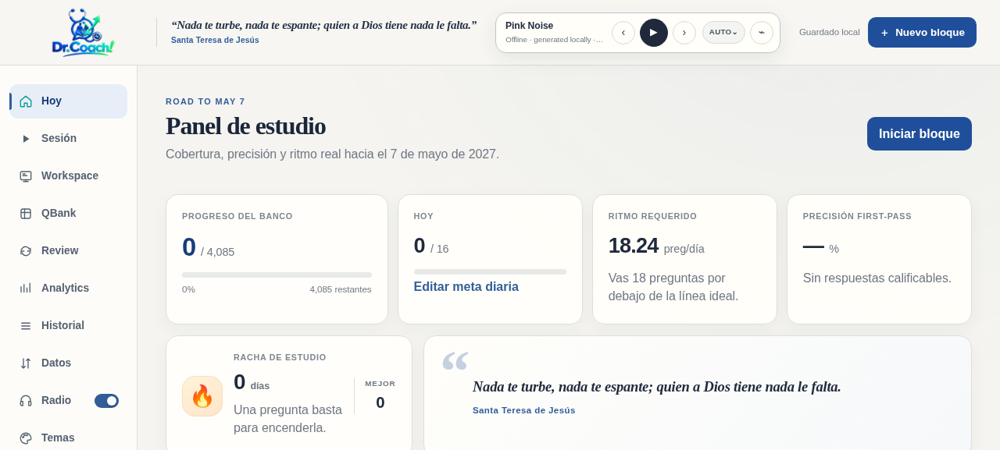
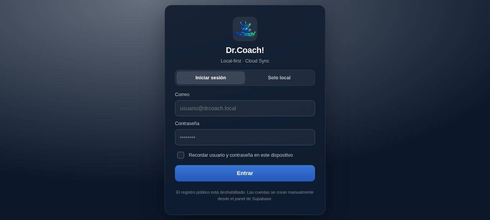
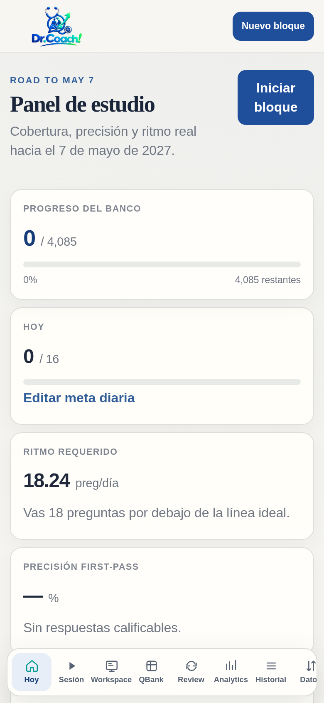

# Dr.Coach!

[](docs/CHANGELOG.md)
[](docs/ESTRUCTURA.md)
[](#)

Workspace de estudio **local-first**: QBank tracking, Review, Study Board de evidencias, AI Study Dossier y Focus Radio. Funciona 100 % offline y, opcionalmente, sincroniza con **Supabase** (Cloud Sync multi-dispositivo).

Es una web estática: **no necesita instalación, build ni dependencias**. Se abre `index.html` y listo.

## 📸 Capturas

| Panel de estudio (escritorio) |
|---|
|  |

| Acceso: elige tu modo | En el móvil |
|---|---|
|  |  |

---

## 🗂 Estructura del proyecto

Cada carpeta tiene un único propósito, para que el mantenimiento sea simple:

```
drcoach/
├── index.html            ← ENTRADA: la única página (Interfaz y estructura HTML)
├── manifest.webmanifest  ← Configuración de la app instalable (PWA)
├── sw.js                 ← Service Worker: cachea archivos para modo offline
│
├── css/
│   └── styles.css        ← 🎨 TODO el estilo (colores, temas, layout, responsive)
│
├── js/
│   ├── db.js             ← 🗄 Base de datos LOCAL (IndexedDB: intentos, sesiones, ajustes…)
│   ├── app.js            ← ⚙️ Lógica principal de la app (QBank, Review, Study Board, Radio…)
│   └── zip.js            ← Utilidad para generar backups ZIP
│
├── cloud/                ← ☁️ Integración con Supabase (Cloud Sync)
│   ├── supabase-client.js   Carga del SDK + fallback offline
│   ├── auth.js              Overlay de login (2 usuarios + "Solo local")
│   ├── sync.js              Pull/Push de datos, cola de sincronización
│   ├── storage.js           Subida/bajada de capturas (imágenes)
│   └── sync-indicator.js    Indicador "☁ Guardado / 💾 Solo local"
│
├── config/
│   ├── supabase.config.example.js  ← Plantilla de credenciales
│   └── supabase.config.js          ← Project URL + anon key (SÍ se sube desde v3.2.6: clave pública por diseño)
│
├── supabase/
│   └── schema.sql        ← 🗄 Base de datos en la NUBE (tablas + seguridad RLS)
│
├── assets/
│   ├── img/              ← Logo y emblema
│   └── icons/            ← Iconos de la app instalable (192/512)
│
├── companions/           ← Extras que NO forman parte de la web
│   ├── browser-extension/   Extensión de Chrome (DrCoach-Companion)
│   └── mobile-userscript/   Userscript multi-gestor: Tampermonkey (Android/PC) y Safari iOS/iPadOS (apps Userscripts/Stay)
│
├── .github/              ← Plantillas de issues y PR (para el mantenimiento en GitHub)
│
├── scripts/
│   ├── serve.py          ← Servidor local (python3 scripts/serve.py)
│   ├── check.sh          ← Chequeo pre-publicación (bash scripts/check.sh)
│   ├── release.sh        ← Publicar versión (bash scripts/release.sh patch)
│   ├── backup.sh         ← Copia de seguridad (bash scripts/backup.sh)
│   └── Abrir DrCoach.command  ← Doble clic en macOS para abrir la app
│
└── docs/
    ├── ESTRUCTURA.md     ← 📖 Mapa "¿dónde toco qué?" — EMPIEZA AQUÍ
    ├── BD-MANTENIMIENTO.md ← 🗄️ Runbook de base de datos (diagnóstico y arreglos)
    ├── CHANGELOG.md      ← Historial de versiones
    ├── INSTALL-CLOUD.md  ← Guía de configuración de Supabase paso a paso
    ├── GITHUB-PAGES.md   ← Guía para publicar/actualizar tu web en GitHub
    ├── INSTALAR-APP.md   ← 📲 Instalar la PWA en iPad/Android/Mac/PC
    ├── GITHUB-ACTIONS-PAGES.md ← (Opcional) deploy automático con Actions
    ├── img/              ← Capturas usadas en este README
    └── DISTRIBUCION.md   ← Notas históricas de distribución (v2.6.7)
```

> **¿Por qué `index.html`, `sw.js` y `manifest.webmanifest` van sueltos en la raíz?**
> El Service Worker solo puede controlar la carpeta donde vive (*scope*). En la raíz cubre toda la app. No los muevas.

---

## 🚀 Cómo abrirla

**Opción A — Local (macOS):** doble clic en `scripts/Abrir DrCoach.command`.
**Opción B — Local (cualquier sistema):** `python3 scripts/serve.py` → abre `http://localhost:8080`.
**Opción C — GitHub Pages:** es la forma recomendada (HTTPS necesario para Focus Radio).
**📲 Instalarla como app** (icono propio, pantalla completa, offline) en iPad/Android/Mac/PC: **`docs/INSTALAR-APP.md`**.

> ⚠️ No abras `index.html` con doble clic como archivo (`file://`): el Service Worker y Focus Radio requieren HTTP/HTTPS.

---

## 🌐 Publicar / actualizar en GitHub Pages

Guía completa paso a paso (subir el repo, activar Pages, verificar, dominio propio, problemas frecuentes): **`docs/GITHUB-PAGES.md`**.

Resumen rápido:

1. Sube/reemplaza el contenido de esta carpeta en tu repositorio (manteniendo las carpetas tal cual).
2. Espera a que GitHub Pages termine el deploy.
3. **Recarga forzada una vez** (Ctrl+Shift+R / Cmd+Shift+R) para que el Service Worker tome la nueva versión.

Con git, desde esta carpeta:

```bash
git init                  # solo la primera vez
git add .
git commit -m "Dr.Coach! v3.0.2"
git remote add origin https://github.com/TU-USUARIO/TU-REPO.git
git push -u origin main   # (o master, según tu repo)
```

Para futuras actualizaciones: cambia los archivos → `git add .` → `git commit -m "..."` → `git push`.

> 🤖 ¿Quieres que cada push publique solo (sin tocar Settings)? Guía opcional: **`docs/GITHUB-ACTIONS-PAGES.md`**.

> 🔒 `config/supabase.config.js` solo contiene la Project URL y la **anon public key** — la clave pública del navegador, diseñada por Supabase para viajar en toda app frontend (cualquier visitante ya puede verla en DevTools al usar la web). La protección real son **RLS** + cuentas email/contraseña creadas a mano (ver `docs/INSTALL-CLOUD.md §10`). **Nunca** pongas ahí la `service_role` key.

> 🖼️ ¿Vas a compartir el enlace de tu repo? Sube `docs/img/social-preview.png` como tarjeta social (Settings → Social preview) — pasos en `docs/GITHUB-PAGES.md` § 6.

---

## 🧰 Mantenimiento rápido

| Quiero… | Voy a… |
|---|---|
| Cambiar colores / estilos | `css/styles.css` |
| Corregir un bug de la app | `js/app.js` |
| Arreglar la base de datos local | `js/db.js` (stores de IndexedDB) — runbook: `docs/BD-MANTENIMIENTO.md` |
| Arreglar la base de datos de la nube | `supabase/schema.sql` + `cloud/sync.js` — runbook: `docs/BD-MANTENIMIENTO.md` |
| Cambiar credenciales de Supabase | `config/supabase.config.js` |
| Cambiar la interfaz (HTML) | `index.html` |
| Actualizar logo / iconos | `assets/img/` y `assets/icons/` |
| Publicar una nueva versión | `bash scripts/release.sh patch` (o minor/major) |
| Comprobar que todo está listo para publicar | `bash scripts/check.sh` |
| Instalar la app en un dispositivo | Guía: `docs/INSTALAR-APP.md` |
| Hacer una copia de seguridad | `bash scripts/backup.sh` (código + historial git; tu progreso se exporta desde la app) |

Guía completa: **`docs/ESTRUCTURA.md`** · Base de datos: **`docs/BD-MANTENIMIENTO.md`** · Historial: **`docs/CHANGELOG.md`** · Nube: **`docs/INSTALL-CLOUD.md`**

---

## ☁️ Cloud Sync (opcional)

Sin configurar nada, la app funciona en **modo local** (todo en tu navegador). Para sincronizar entre dispositivos (PC, iPad, Lenovo Pad) con los mismos datos: sigue **`docs/INSTALL-CLOUD.md`** (≈10 minutos: schema SQL + 2 usuarios + config).
