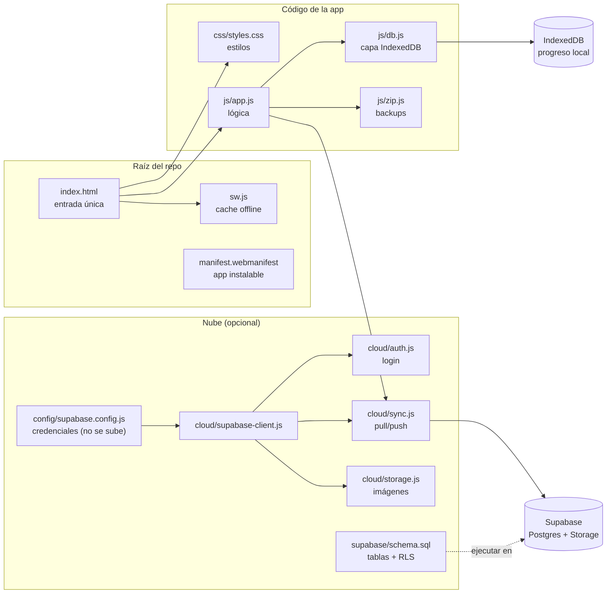
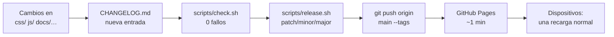

# Mapa de mantenimiento — ¿dónde toco qué?

Esta es la brújula del proyecto. La idea: **cada problema tiene una carpeta asignada**.

## Arquitectura en un vistazo

> Regla del flujo: **`js/db.js` + IndexedDB son la fuente de la verdad local**; `cloud/` es un espejo opcional. Si quitas la nube, la app sigue completa.

---

## 1. Mapa por tipo de problema

### 🎨 "Quiero cambiar el aspecto visual"
→ **`css/styles.css`**
- Los temas de color (estaciones/ambiente) están al inicio del archivo, como variables CSS.
- Todo el responsive (tablet/móvil) está al final, en los `@media`.
- No toques los nombres de clase desde aquí: van emparejados con `index.html`.

### ⚙️ "La app tiene un bug" (preguntas, sesiones, Study Board, Radio…)
→ **`js/app.js`**
- Toda la lógica vive aquí (es un archivo grande a propósito: sin build, sin bundler).
- Cabecera útil:
  - `APP_VERSION` → versión mostrada en el pie.
  - `SCHEMA_VERSION` → versión del formato de datos.
  - `TARGET_TOTAL` / `DEADLINE` → meta de preguntas y fecha objetivo.

### 🗄 "Bug o cambio en la base de datos LOCAL" (progreso guardado en el navegador)
→ **`js/db.js`** · Runbook completo paso a paso: **`docs/BD-MANTENIMIENTO.md`**
- IndexedDB (`mediospira-db`, versión 2). Stores: `attempts`, `sessions`, `settings`, `attachments`, `baselines`, `pending_syncs`.
- Si algún día añades un store nuevo: súbelo en `DB_VERSION` y crea el store dentro de `onupgradeneeded` (ya hay un ejemplo con `pending_syncs`).
- Síntomas típicos, cómo inspeccionar la base con DevTools y cómo reparar con export/import: ver el runbook.

### ☁️ "Bug o cambio en la base de datos de la NUBE (Supabase)"
Tres sitios, por orden de sospecha:
1. **`supabase/schema.sql`** → tablas, políticas RLS, bucket. Si cambias algo aquí, vuelve a ejecutarlo en Supabase Dashboard → SQL Editor.
2. **`cloud/sync.js`** → cómo se empujan/jalen los datos, cola `pending_syncs`.
3. **`cloud/storage.js`** → subida de imágenes al bucket `study-evidence`.

También: `docs/BD-MANTENIMIENTO.md` § 4 y § 6 (síntomas y ritual de cambios de datos).

### 🔐 "Credenciales / login / usuarios"
→ **`config/supabase.config.js`** (URL + anon key + usuarios sugeridos).
- La plantilla limpia es `config/supabase.config.example.js`.
- Este archivo NO se sube a GitHub (protegido por `.gitignore`).
- El overlay de login vive en `cloud/auth.js`.

### 🧱 "Quiero cambiar la interfaz / textos / secciones"
→ **`index.html`**
- Es la única página. Arriba el shell de la app, al final los `<script>` (respeta su orden: `db` → `zip` → `config` → `cloud/*` → `app`).

### 📴 "La app no funciona offline / no actualiza"
→ **`sw.js`**
- Si cambias archivos nuevos o rutas, actualiza la lista `ASSETS`.
- **Cada despliegue** incrementa `CACHE` (p. ej. `drcoach-v3.0.2-…`) para forzar la renovación en los dispositivos.
- Regla de oro: `sw.js`, `index.html` y `manifest.webmanifest` nunca salen de la raíz.

### 🖼 "Cambiar logo o iconos"
→ `assets/img/` (logo y emblema `.webp`) y `assets/icons/` (iconos PWA 192/512).
- Si cambias nombres/rutas: actualiza `index.html` (2 sitios), `manifest.webmanifest`, `sw.js` y el fallback en `cloud/auth.js`.

### 🧩 "La extensión de Chrome / el script de móvil"
→ `companions/browser-extension/` y `companions/mobile-userscript/`.
- Son proyectos independientes: se instalan por su cuenta y no afectan a la web.

### 📲 "Instalar la app en un dispositivo" (iPad, Android, Mac, PC)
→ **`docs/INSTALAR-APP.md`**
- Pasos por plataforma, actualizaciones de la app instalada y dónde viven los datos.

### 💾 "Quiero una copia de seguridad del proyecto"
→ **`bash scripts/backup.sh`**
- ZIP del código + bundle del historial git; conserva las 8 más recientes. Tu progreso de estudio se exporta desde la app (Datos → Exportar).

---

## 2. Publicar una nueva versión (ritual completo)

**Atajo (recomendado):** `bash scripts/release.sh patch` (o `minor` / `major`).
Hace los pasos 3 y 5 automáticamente: sube la versión en `js/app.js`, renueva la caché en `sw.js`, actualiza la insignia del `README.md`, hace commit y crea el tag `vX.Y.Z`. Tú solo escribes los cambios en `docs/CHANGELOG.md`, confirmas y haces `git push origin main --tags`.

Si prefieres hacerlo a mano:

1. **Haz tus cambios** en la carpeta correspondiente.
2. **Anota el cambio** en `docs/CHANGELOG.md` (entrada nueva arriba) y haz commit.
3. **Chequeo**: `bash scripts/check.sh` → debe terminar en **0 fallos** (estructura, secretos, versiones, rutas, offline, PWA instalable, enlaces de docs).
4. **Bump de versión** en 3 sitios:
   - `js/app.js` → `APP_VERSION = 'x.y.z'`
   - `sw.js` → `const CACHE = 'drcoach-x.y.z-<nota>'`
   - `README.md` → insignia de versión.
5. **Sube a GitHub**: `git push origin main --tags`.
6. **En tus dispositivos**: **una recarga normal basta** — el Service Worker renueva la caché él solo y borra la vieja (desde v3.0.2).

> El progreso guardado (IndexedDB) sobrevive a cualquier actualización: el nombre de la base no cambia.

---

## 3. Reglas para que esto siga ordenado

- **Un tipo de archivo → una carpeta.** Si vas a añadir algo, pregúntate de qué es: ¿estilo → `css/`, ¿lógica → `js/`, ¿imagen → `assets/`, ¿nube → `cloud/` o `config/`, ¿guía → `docs/`?
- **Nada nuevo en la raíz** salvo los 3 archivos de entrada (`index.html`, `sw.js`, `manifest.webmanifest`).
- **Nunca subir** `config/supabase.config.js` (está en `.gitignore` por algo).
- Si añades un archivo JS nuevo, cárgalo en `index.html` **antes** de `js/app.js` y añádelo a `ASSETS` en `sw.js`.
